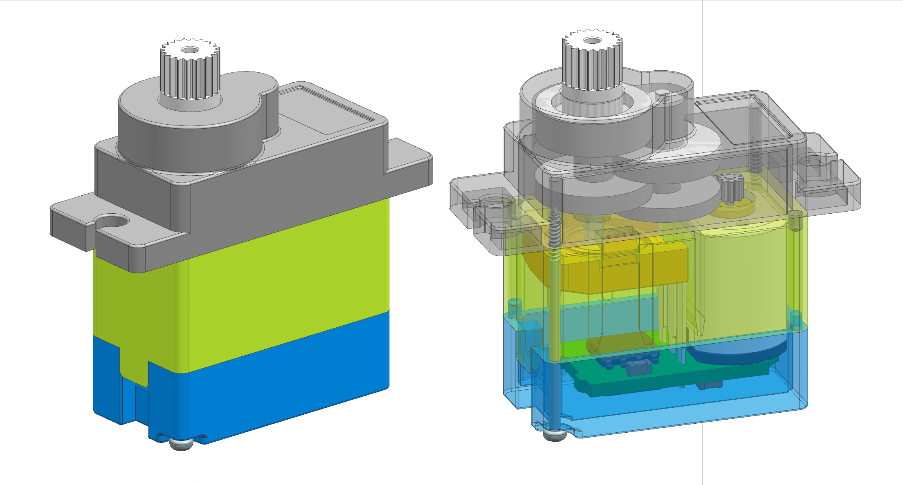

# Step files used for modeling the switch
All step files are freely downloadable over grabcad and weren't designed by me, so big thanks to the creators.
The links for the files & preview pictures are linked underneath each preview.

## DHT22 Hunidity + Temperature Sensor

[STEP file](./DHT22_Module_v3.step)
[Download from Grabcad](https://grabcad.com/library/dht22-module-1)

## SG90 motor

[STEP file](./SG90_Servo_Motor.step)
[Download from Grabcad](https://grabcad.com/library/sg90-servomotor-180-1)
